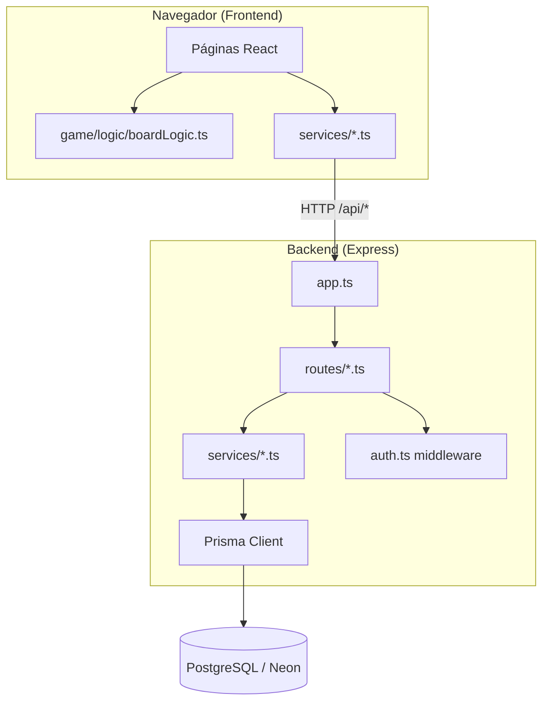
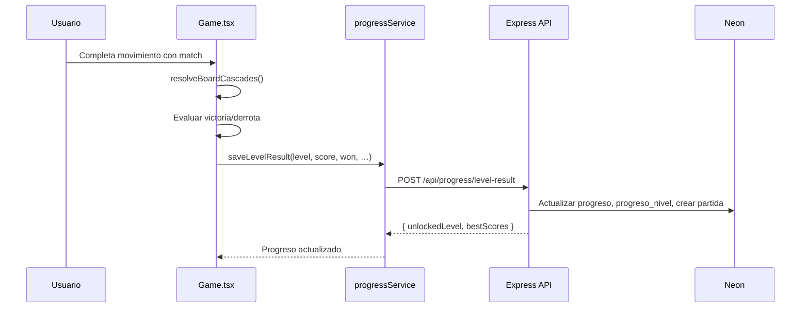
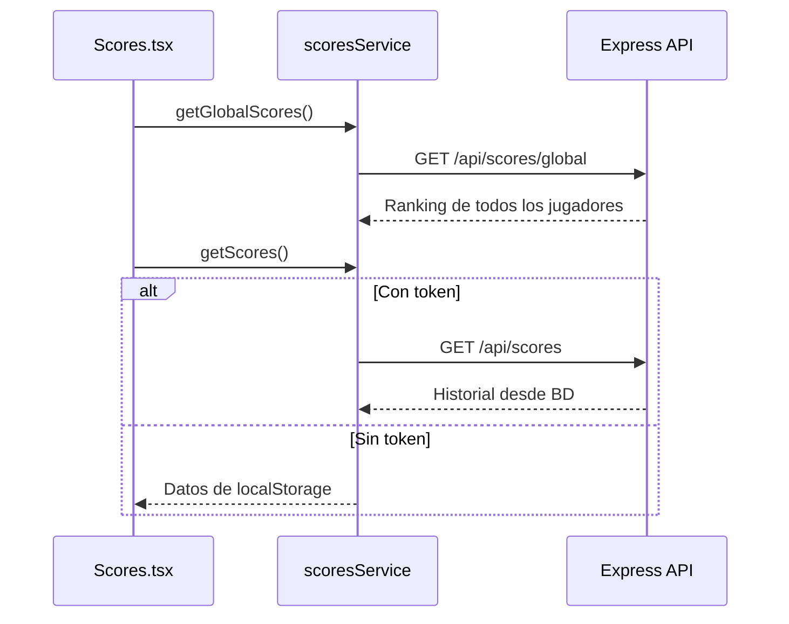

# GemQuest — Documentación Técnica

Juego web Match-3 con autenticación, progreso persistente y ranking de puntajes.  
Stack: **React + Vite** (frontend) · **Express + Prisma** (backend) · **PostgreSQL / Neon** (base de datos).

--
s
## Tabla de contenidos

1. [Arquitectura general](#1-arquitectura-general)
2. [Estructura del repositorio](#2-estructura-del-repositorio)
3. [Frontend](#3-frontend)
4. [Lógica del juego](#4-lógica-del-juego)
5. [Backend](#5-backend)
6. [Base de datos](#6-base-de-datos)
7. [Comunicación Frontend ↔ Backend](#7-comunicación-frontend--backend)
8. [Autenticación y seguridad](#8-autenticación-y-seguridad)
9. [API REST — Referencia de endpoints](#9-api-rest--referencia-de-endpoints)
10. [Variables de entorno](#10-variables-de-entorno)
11. [Instalación y ejecución](#11-instalación-y-ejecución)
12. [Flujos principales](#12-flujos-principales)
13. [Guía rápida de modificación](#13-guía-rápida-de-modificación)

---

## 1. Arquitectura general

El proyecto sigue una arquitectura **cliente-servidor** desacoplada:

- El **frontend** ejecuta toda la lógica del tablero Match-3 en el navegador.
- El **backend** expone una API REST para usuarios, progreso y puntajes.
- La **base de datos** en Neon almacena jugadores, partidas y configuración de niveles.



### Modos de operación

| Modo | Progreso | Puntajes | Requisito |
|------|----------|----------|-----------|
| **Invitado** | `localStorage` | `localStorage` | Ninguno |
| **Autenticado** | API + Neon | API + Neon | Login + backend activo |

El ranking **global** siempre consulta la API (público). Solo aparecen partidas guardadas en la base de datos.

---

## 2. Estructura del repositorio

```
GemQuest-Juego-web-Match-3-/
├── frontend/                    # Cliente React + Vite
│   ├── src/
│   │   ├── assets/images/       # Gemas, fondos de niveles
│   │   ├── components/          # Componentes reutilizables (MenuPanel)
│   │   ├── config/              # api.ts — cliente HTTP
│   │   ├── game/
│   │   │   ├── config/levels.ts # Dificultad y objetivos
│   │   │   ├── logic/boardLogic.ts  # Reglas Match-3
│   │   │   └── types/gameTypes.ts   # Tipos Gem, Board, GemColor
│   │   ├── pages/               # Pantallas (Home, Game, Auth, Scores…)
│   │   ├── routes/AppRouter.tsx # Rutas de la aplicación
│   │   ├── services/            # Capa de integración con la API
│   │   └── styles/              # CSS global y menús
│   ├── vite.config.ts           # Proxy /api → localhost:3001
│   └── .env.example
│
├── backend/                     # API Express + Prisma
│   ├── prisma/
│   │   ├── schema.prisma        # Modelo de datos
│   │   └── seed.ts              # Datos iniciales (3 niveles)
│   ├── src/
│   │   ├── app.ts               # Express app, CORS, rutas
│   │   ├── index.ts             # Punto de entrada
│   │   ├── config/env.ts        # Variables de entorno validadas
│   │   ├── lib/prisma.ts        # Cliente Prisma
│   │   ├── middleware/auth.ts   # Verificación JWT
│   │   ├── routes/              # auth, progress, scores
│   │   └── services/            # Lógica de negocio
│   └── .env.example
│
└── DOCUMENTACION_TECNICA.md     # Este documento
```

---

## 3. Frontend

### 3.1 Tecnologías

| Tecnología | Versión | Uso |
|------------|---------|-----|
| React | 19.x | UI y estado de componentes |
| React Router | 7.x | Navegación SPA |
| Vite | 8.x | Bundler y servidor de desarrollo |
| TypeScript | 6.x | Tipado estático |
| react-icons | 5.x | Iconografía en menús |

### 3.2 Rutas

Definidas en `frontend/src/routes/AppRouter.tsx`:

| Ruta | Componente | Descripción |
|------|------------|-------------|
| `/` | `Home` | Menú principal |
| `/login` | `Login` | Inicio de sesión |
| `/register` | `Register` | Registro de cuenta |
| `/forgot-password` | `ForgotPassword` | Solicitud de recuperación |
| `/reset-password` | `ResetPassword` | Nueva contraseña (token en URL) |
| `/levels` | `LevelSelect` | Selección de nivel |
| `/game?level=N` | `Game` | Partida activa |
| `/scores` | `Scores` | Ranking global y puntajes personales |
| `/results` | `Results` | Pantalla de resultados (placeholder) |

### 3.3 Capa de servicios

| Archivo | Responsabilidad |
|---------|-----------------|
| `config/api.ts` | Función `apiFetch()` — peticiones HTTP con token JWT opcional |
| `services/authService.ts` | Login, registro, sesión en `localStorage` |
| `services/progressService.ts` | Progreso del jugador y guardado de resultados |
| `services/scoresService.ts` | Puntajes personales, globales y respaldo local |

### 3.4 Almacenamiento local (modo invitado)

| Clave `localStorage` | Contenido |
|----------------------|-----------|
| `gemquest_token` | JWT de sesión |
| `gemquest_player` | Datos del jugador (`id`, `nombre`, `email`) |
| `gemquest_progress` | Nivel desbloqueado y mejores puntajes |
| `gemquest_scores` | Historial y récords locales |

### 3.5 Componentes compartidos

- `components/MenuPanel/MenuPanel.tsx` — Contenedor de menú con marco metálico y remaches.
- `components/MenuPanel/MenuField.tsx` — Campo de formulario con icono de gema.
- `styles/menuPanel.css` — Estilos del sistema de menús (botones cristal, pills, campos).

---

## 4. Lógica del juego

### 4.1 Tipos de datos

Archivo: `frontend/src/game/types/gameTypes.ts`

```typescript
type GemColor = "blue" | "purple" | "green" | "yellow" | "red";
type Gem = { id: string; row: number; col: number; color: GemColor };
type Board = Gem[][];
```

### 4.2 Tablero

| Parámetro | Valor | Ubicación |
|-----------|-------|-----------|
| Filas | 8 | `createBoard(rows = 8, …)` |
| Columnas | 8 | `createBoard(…, cols = 8)` |
| Tipos de gema | 5 colores | `GEM_COLORS` en `boardLogic.ts` |
| Imágenes | PNG por color | `assets/images/gems/index.ts` |

El tablero se genera en el cliente. **No se persiste en la base de datos.**

### 4.3 Reglas Match-3

Archivo: `frontend/src/game/logic/boardLogic.ts`

| Función | Descripción |
|---------|-------------|
| `createBoard()` | Crea tablero 8×8 sin combinaciones iniciales |
| `areAdjacent()` | Valida que dos gemas sean vecinas (horizontal o vertical) |
| `swapGems()` | Intercambia dos gemas en el tablero |
| `findMatches()` | Detecta secuencias de 3 o más gemas iguales (H y V) |
| `removeMatchesAndRefill()` | Elimina gemas coincidentes y deja caer nuevas |
| `resolveBoardCascades()` | Repite match + refill hasta que no haya más combos |

### 4.4 Puntuación y objetivos

Implementados en `frontend/src/pages/Game/Game.tsx`:

- **Puntos por movimiento:** `totalMatches × 100` (cada gema eliminada en cascada cuenta como 1 match).
- **Animación de match:** 400 ms (`MATCH_ANIMATION_MS`) antes de aplicar cascadas.
- **Tipos de objetivo** (`levels.ts`):

| Tipo | Campo | Condición de victoria |
|------|-------|----------------------|
| `score` | `targetScore` | `score >= targetScore` |
| `collect` | `targetCount` + `targetColor: "red"` | `redCollected >= targetCount` |

- **Derrota:** movimientos llegan a 0 sin cumplir el objetivo.

### 4.5 Configuración de niveles

Archivo: `frontend/src/game/config/levels.ts` (fuente de verdad para el juego)

| ID | Título | Objetivo | Movimientos |
|----|--------|----------|-------------|
| 1 | Bosque Cristalino | 3 800 puntos | 15 |
| 2 | Cueva de Rubíes | 42 gemas rojas | 14 |
| 3 | Templo Obsidiana | 7 200 puntos | 12 |

> **Nota:** Los mismos valores deben sincronizarse en `backend/prisma/seed.ts` si se desea consistencia en la BD.

### 4.6 Ciclo de una jugada

```
Click gema A → Click gema B (adyacente)
  → swapGems()
  → findMatches()
  → Si hay match:
       → Animación 400 ms
       → resolveBoardCascades()
       → Actualizar score, movimientos, rojas
       → Evaluar victoria/derrota
       → saveLevelResult() (API o localStorage)
  → Si no hay match: revertir visualmente
```

---

## 5. Backend

### 5.1 Tecnologías

| Tecnología | Uso |
|------------|-----|
| Express 5 | Servidor HTTP y rutas |
| Prisma 6 | ORM para PostgreSQL |
| jsonwebtoken | Tokens JWT |
| bcryptjs | Hash de contraseñas |
| zod | Validación de entrada y env |
| nodemailer | Correos de recuperación (opcional) |
| cors | Política de origen cruzado |

### 5.2 Punto de entrada

```
index.ts → app.listen(PORT)
app.ts   → middleware, montaje de rutas
```

Rutas montadas:

```typescript
app.use("/api/auth", authRoutes);
app.use("/api/progress", progressRoutes);
app.use("/api/scores", scoresRoutes);
```

### 5.3 Capas

| Capa | Ubicación | Rol |
|------|-----------|-----|
| **Routes** | `src/routes/*.ts` | Definición HTTP, códigos de respuesta |
| **Services** | `src/services/*.ts` | Lógica de negocio y acceso a Prisma |
| **Middleware** | `src/middleware/auth.ts` | Verificación de JWT |
| **Config** | `src/config/env.ts` | Variables de entorno con validación Zod |

### 5.4 Servicios

| Servicio | Archivo | Funciones principales |
|----------|---------|----------------------|
| Auth | `auth.service.ts` | `registerPlayer`, `loginPlayer`, `requestPasswordReset`, `resetPassword` |
| Progress | `progress.service.ts` | `getPlayerProgress`, `saveLevelResult`, `listLevels` |
| Scores | `scores.service.ts` | `getPlayerScores`, `getGlobalBestScores` |
| Email | `email.service.ts` | Envío SMTP o log en consola (desarrollo) |

---

## 6. Base de datos

### 6.1 Proveedor

- **PostgreSQL** hospedado en [Neon](https://neon.tech).
- Conexión vía `DATABASE_URL` en `backend/.env`.
- ORM: Prisma (`backend/prisma/schema.prisma`).

### 6.2 Diagrama entidad-relación

```mermaid
erDiagram
    Jugador ||--o| Progreso : tiene
    Jugador ||--o{ ProgresoNivel : tiene
    Jugador ||--o{ Partida : juega
    Jugador ||--o{ PasswordResetToken : solicita
    Nivel ||--o{ Partida : contiene
    Nivel ||--o{ ProgresoNivel : registra

    Jugador {
        int id PK
        string nombre
        string email UK
        string password_hash
        datetime creado_en
    }

    Nivel {
        int id PK
        int numero UK
        string objetivo
        int movimientos_maximos
        int puntaje_meta
        json configuracion_json
    }

    Partida {
        int id PK
        int jugador_id FK
        int nivel_id FK
        int puntaje
        int movimientos_usados
        int tiempo_nivel_segundos
        string resultado
        datetime fecha
    }

    Progreso {
        int id PK
        int jugador_id FK UK
        int nivel_desbloqueado
        datetime actualizado_en
    }

    ProgresoNivel {
        int id PK
        int jugador_id FK
        int nivel_id FK
        int mejor_puntaje
        boolean completado
    }
```

### 6.3 Tablas

| Tabla | Descripción |
|-------|-------------|
| `jugadores` | Cuentas de usuario |
| `niveles` | Configuración de los 3 niveles del juego |
| `partidas` | Historial de cada partida terminada |
| `progreso` | Último nivel desbloqueado por jugador |
| `progreso_nivel` | Mejor puntaje y estado de completado por nivel |
| `password_reset_tokens` | Tokens hasheados para recuperación de contraseña |

### 6.4 Seed

```bash
cd backend
npm run db:seed
```

Ejecuta `prisma/seed.ts`, que hace `upsert` de los 3 niveles en la tabla `niveles`.

---

## 7. Comunicación Frontend ↔ Backend

### 7.1 Desarrollo local

```
Frontend (Vite) :5173
       │
       │  fetch("/api/...")
       ▼
Proxy Vite (vite.config.ts)
       │
       │  → http://localhost:3001/api/...
       ▼
Backend (Express) :3001
       │
       ▼
Neon PostgreSQL
```

### 7.2 Cliente HTTP

`frontend/src/config/api.ts`:

```typescript
export async function apiFetch<T>(path: string, options?: RequestInit): Promise<T>
```

- Prefijo: `VITE_API_URL` o cadena vacía (usa proxy en desarrollo).
- Header `Authorization: Bearer <token>` si existe sesión en `localStorage`.
- Lanza `Error` con mensaje del servidor si `response.ok === false`.

### 7.3 CORS

Configurado en `backend/src/app.ts`:

```typescript
cors({ origin: env.CORS_ORIGIN, credentials: true })
```

En desarrollo con proxy de Vite, CORS no aplica para rutas relativas `/api`.  
En producción, `CORS_ORIGIN` debe apuntar a la URL del frontend desplegado.

---

## 8. Autenticación y seguridad

### 8.1 Flujo de registro / login

1. Frontend envía `POST /api/auth/register` o `POST /api/auth/login`.
2. Backend valida datos, hashea contraseña con **bcrypt**.
3. Backend genera **JWT** firmado con `JWT_SECRET`.
4. Frontend guarda `token` y `jugador` en `localStorage`.
5. Al registrarse, se crean registros iniciales en `progreso` y `progreso_nivel`.

### 8.2 Rutas protegidas

El middleware `authMiddleware` (`backend/src/middleware/auth.ts`):

1. Lee header `Authorization: Bearer <token>`.
2. Verifica JWT con `jwt.verify()`.
3. Adjunta `req.user = { jugadorId, email }`.

### 8.3 Recuperación de contraseña

1. `POST /api/auth/forgot-password` → genera token hasheado en BD.
2. Si SMTP está configurado, envía correo con enlace a `/reset-password?token=…`.
3. Si no hay SMTP, imprime el enlace en la consola del backend (solo desarrollo).

---

## 9. API REST — Referencia de endpoints

### Salud

| Método | Ruta | Auth | Respuesta |
|--------|------|------|-----------|
| `GET` | `/api/health` | No | `{ status: "ok", service: "gemquest-api" }` |

### Autenticación — `/api/auth`

| Método | Ruta | Auth | Body | Respuesta |
|--------|------|------|------|-----------|
| `POST` | `/register` | No | `{ nombre, email, password }` | `{ token, jugador }` |
| `POST` | `/login` | No | `{ email, password }` | `{ token, jugador }` |
| `GET` | `/me` | Sí | — | Perfil del jugador |
| `POST` | `/forgot-password` | No | `{ email }` | `{ message }` |
| `POST` | `/reset-password` | No | `{ token, password }` | `{ message }` |

### Progreso — `/api/progress`

| Método | Ruta | Auth | Body / Respuesta |
|--------|------|------|------------------|
| `GET` | `/` | Sí | `{ unlockedLevel, bestScores: { 1: n, 2: n, 3: n } }` |
| `POST` | `/level-result` | Sí | Body: `{ level, score, won, movesUsed?, levelTimeSeconds? }` → progreso actualizado |
| `GET` | `/levels` | No | Lista de niveles desde BD |

### Puntajes — `/api/scores`

| Método | Ruta | Auth | Respuesta |
|--------|------|------|-----------|
| `GET` | `/global` | No | `{ bestScores: GlobalScoreRecord[] }` — mejor puntaje de cada jugador por nivel |
| `GET` | `/` | Sí | `{ bestScores, history }` — récords e historial del jugador autenticado |

**`GlobalScoreRecord`:** incluye `jugadorNombre` además de los campos de partida.

---

## 10. Variables de entorno

### Backend (`backend/.env`)

| Variable | Requerida | Descripción |
|----------|-----------|-------------|
| `DATABASE_URL` | Sí | Connection string de Neon |
| `JWT_SECRET` | Sí | Secreto para firmar JWT (no proviene de Neon) |
| `PORT` | No | Puerto del servidor (default: `3001`) |
| `CORS_ORIGIN` | No | Origen del frontend (default: `http://localhost:5173`) |
| `FRONTEND_URL` | No | URL base para enlaces de reset de contraseña |
| `SMTP_HOST` | No | Servidor SMTP |
| `SMTP_PORT` | No | Puerto SMTP |
| `SMTP_USER` | No | Usuario SMTP |
| `SMTP_PASS` | No | Contraseña SMTP |
| `SMTP_FROM` | No | Remitente del correo |

### Frontend (`frontend/.env`)

| Variable | Requerida | Descripción |
|----------|-----------|-------------|
| `VITE_API_URL` | No | URL base del API. Vacío = proxy de Vite en desarrollo |

---

## 11. Instalación y ejecución

### Requisitos

- Node.js 20+
- Cuenta en Neon con base de datos PostgreSQL

### Backend

```bash
cd backend
cp .env.example .env
# Editar .env con DATABASE_URL y JWT_SECRET
npm install
npm run db:setup    # generate + push + seed
npm run dev         # http://localhost:3001
```

### Frontend

```bash
cd frontend
cp .env.example .env   # opcional
npm install
npm run dev            # http://localhost:5173
```

### Scripts útiles (backend)

| Script | Acción |
|--------|--------|
| `npm run dev` | Servidor con recarga en caliente |
| `npm run build` | Compila TypeScript a `dist/` |
| `npm run start` | Ejecuta build de producción |
| `npm run db:generate` | Genera cliente Prisma |
| `npm run db:push` | Sincroniza schema con la BD |
| `npm run db:seed` | Inserta/actualiza niveles |
| `npm run db:setup` | generate + push + seed |

---

## 12. Flujos principales

### 12.1 Partida con usuario autenticado



### 12.2 Consulta de puntajes



### 12.3 Desbloqueo de niveles

Al ganar el nivel `N` (si `N < 3`), `saveLevelResult` en el backend actualiza `progreso.nivel_desbloqueado` a `N + 1`.

---

## 13. Guía rápida de modificación

| Quiero cambiar… | Archivo(s) |
|-----------------|------------|
| Tamaño del tablero | `frontend/src/game/logic/boardLogic.ts` → `createBoard(rows, cols)` |
| Cantidad / tipos de gemas | `gameTypes.ts`, `GEM_COLORS`, imágenes en `assets/images/gems/` |
| Reglas de combinación | `frontend/src/game/logic/boardLogic.ts` |
| Puntos por gema | `frontend/src/pages/Game/Game.tsx` → `totalMatches * 100` |
| Dificultad de niveles | `frontend/src/game/config/levels.ts` + `backend/prisma/seed.ts` |
| Duración animación match | `Game.tsx` (`MATCH_ANIMATION_MS`) + `Game.css` |
| Pantallas y rutas | `frontend/src/routes/AppRouter.tsx` |
| Estilos de menús | `frontend/src/styles/menuPanel.css` |
| Endpoints del API | `backend/src/routes/*.ts` |
| Lógica de negocio | `backend/src/services/*.ts` |
| Modelo de datos | `backend/prisma/schema.prisma` |
| Conexión a Neon | `backend/.env` → `DATABASE_URL` |
| Comunicación HTTP | `frontend/src/config/api.ts`, `frontend/vite.config.ts` |

---
## Licencia y autoría

Proyecto académico — ULEAM, Modelado Ágil 2026-1.
